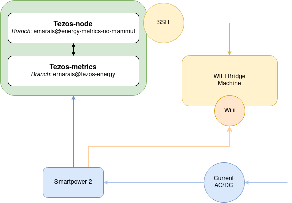

## Project description

This is a small manual to summarize the idea behind this project and how it
works.

## Smartpower

Smartpowers are a piece of hardware you can connect between the power supply and
the computer. It is able to gather metrics about the consumption.

## Architecture example

Below, you can find an example of the smallest architecture I have used to
catch the consumption:



As the smartpowers need to connect to a Wi-Fi point, the machine serving as a Wi-Fi
server must be turned on before them. Otherwise, the smartpowers will try to
reach another Wi-Fi.

## Launch instructions

 * First, you need to have Tezos installed, following [these instructions](https://tezos.gitlab.io/introduction/howtoget.html#setting-up-the-development-environment-from-scratch) and switch to the `emarais@energy-metrics-no-mammut`.
 * Then, you must install Tezos-metrics from [here](https://gitlab.com/maiste/tezos-metrics/-/tree/emarais@tezos-energy) and tezos-oxymeter from
 [here](https://github.com/maiste/tezos-oxymeter).
 * After, that you can run your node with:
   ```sh
   $ ./tezos-node [option] --energy-mode="power:<host>:<port>"
   ```
 * Then, run Tezos-metrics:
   ```sh
   $ ./tezos-metrics --listen-prometheus=9091 --data-dir <dir> -h localhost -p 18732
   ```

You can catch Tezos-metrics data with a tool like prometheus.
